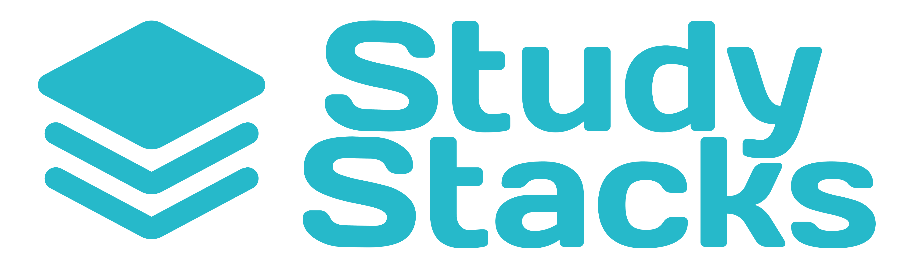

# StudyStacks

  

## Introduction
**StudyStacks** is an iOS flashcard app designed to help users create, study, and share flashcards right from their phone. Whether you're prepping for an exam or just love to learn new things, StudyStacks offers an intuitive experience and no ads! Join StudyStacks, cause no other app stacks up.

## App Demo
Here's a demo of the app running in the simulator with some of the main features highlighted: 

## Main Features
- **Flashcard Stacks** --> Create, study, and browse stacks across multiple subjects from your Dashboard or the built-in Library of public stacks
- **Studying and Remembering** --> Flip over cards to test your knowledge, swipe right if you got it, or left if you need some work
- **Friend System** --> Add friends who also use the app so you can share stacks, see each other's profiles, and compare points on the Leaderboard to see who can study the most cards in any week
- **User Profile** --> Keep track of and update all your saved stacks, created stacks, and personal information in the profile and settings pages
- **Study Reminders + Streaks** --> Set a daily reminder so that we can keep you on target. Keep coming back so that your streak stacks up

## Tech Stack
- Figma for UI/UX Design
- SwiftUI for development
- Firebase Authentication for user authentication
- Firebase Firestore for storing user data, stack data, and friendships

## How to Run Locally
1. Clone this repo: https://github.com/laurenindira/StudyStacks
2. Open the project in Xcode
3. Wait for or install any required dependencies
4. Build & run the app in the iPhone simulator on any phone with iOS 16+

## Acknowledgements & Credits
- Thank you Dr Johnson for your guidance throughout this project!
- Assets: 
- Thank you Quizlet for putting all your original features behind a paywall, it inspired us to make this app.

## Authors
StudyStacks was built by [Lauren Indira](https://github.com/laurenindira), [Raihana Zahra](https://github.com/raihanaza), [Giselle Eliasi](https://github.com/giselleeliasi), and [Brady Katler](https://github.com/bkatler). 
