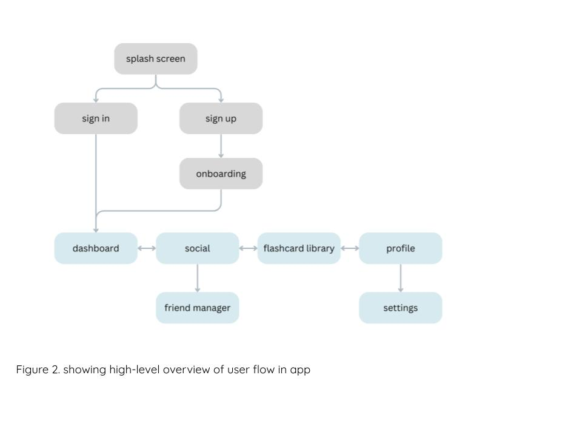

# **Detailed Project Design**

CMSI 543: Agile Development and Project Management  
Collaborators: Raihana Zahra, Lauren Campbell, Giselle Eliasi, Brady Katler  
26 March 2025

## **2.1 Project Overview** 

**Project Name:** StudyStacks

### **2.1.1 Project Description** 

StudyStacks is an iOS application that allows users to create, share, and study flashcards from the convenience of their mobile device. The app will provide an intuitive experience for building flashcard stacks, allow users to discover stacks that are tailored to their topics of interest, deliver daily study reminders, allow users to view stacks made by friends, and encourage continuous learning through a badge and streak system. 

### **2.1.2. Project Management Style**

As a group, we felt that taking a **Scrum** approach to the development of StudyStacks would be the most beneficial due to the focus on shorter iteration cycles, easy adaptability to changing vision, and the continuous feedback with each other. While we’re taking a very collaborative approach, we did define the roles of product owner and scrum master on the team, designating them to Lauren and Brady respectively. 

We decided to use Trello as our project management tool, and it serves as the key location for tracking the product backlog, current sprint goals, ticket assignments and progress. 

We adopted two-week sprints for the duration of the project as it provided more flexibility, and allowed us to reassess our progress at frequent points throughout the semester. We designated weekly stand-up meetings to maintain clear communication, reduce blockers, and give a formal update on progress over time. We have also been completing sprint reviews at the end of each iteration where the work completed is evaluated as a team before either being officially categorized as finished, or new tickets are generated to address any specific issues. Sprint planning is also done in the same meeting as the sprint review in order to define the scope, tickets, and story points for the next sprint.

### **2.1.3 Potential Users** 

The primary users of our application are learners in general – anyone who has an interest in gaining or deepening their knowledge in a specific subject. A major sub-group that we focused on are students of various academic levels and age ranges (going from high school to graduate) that want to seek out an effective studying tool. 

Secondary users include teachers, tutors, and parents who want to create and share study material to help others, and track learning progress. These users could create stacks in the app in order to share it with others, but may not use the other variety of features included in the app. 

### **2.1.4 Key Features**

The main components of the app include flashcards, the social aspect, and study encouragement. Some of the features that fall under these categories can be broken down further:

* Flashcards   
  * Flashcard Stack Creation → users can create and organize their own study stacks by adding cards, attaching a description, and tagging relevant topics for future reference or ease of searching  
  * Flashcard Stack Management → users can edit or delete stacks as needed with a tap of a button  
  * Flashcard Library → users can browse public stacks that are available in the app, search for specific keywords, or filter by the subject area or who the stack was made by

* Social Aspect  
  * Friend Management System → Add, accept, and view friends for stack sharing, to see what your peers are up to, and to access new stacks  
  * Leaderboard → users can compete against their friends to see who can study the most flashcards in any given week, with the winner earning a unique badge

* Study Encouragement  
  * Badge System → users are rewarded with displayable badges for completing goals (e.g. number of decks studied, streak days, etc)  
  * Study Streak Tracking → users can earn another day towards their streak by studying a stack each day, which can lead to them unlocking new badges

* Other features  
  * User Profiles → each user has a profile that serves as a centralized location for their settings, saved decks, decks made by them, and other key statistics  
  * Firebase Authentication → the app allows for users to sign-up via Google authentication and email/password sign in  
  * Settings → Manage personal information, notifications, and app preferences 

## **2.2 Detailed Project Requirements** 

While working on the project, we identified five main epics that we wanted to achieve by the end of the semester, and identified key features that these components would have. These epics are outlined in section 2.2.1, and the child stories that descended from them can be found in section 2.2.2 through to 2.2.7.

### **2.2.1. Project Epics**

* User Sign In/Sign Up   
  * **Epic**: As a learner, I want to be able to have an account in the app so that my data can be saved for future sessions.  
  * The user sign up will allow the user to create a new account to which all their data will be saved  
  * The user sign in will allow the user to access their saved data across devices

* Dashboard   
  * **Epic**: As a learner, I want to be able to see all the relevant study information that I might need at a glance so that I can choose what I want to study conveniently.  
  * The dashboard will allow the user to see a general overview of major features across the app in one place

* Flashcards  
  * **Epic**: As a learner, I want to be able to create and modify flashcards so that I can create a tailored study experience based on my academic needs  
  * The user will be able to create flashcard stacks, edit stacks, and view stacks throughout the app.

* Flashcard Library   
  * **Epic**: As a learner, I want to see all the available flashcards so that I can choose from a wide variety of options  
  * The flashcard library will allow the user to see flashcards from different decks, categories, and users in one place

* User Profile   
  * **Epic**: As a learner, I want to be able to see any data that is saved about me so that I can adjust my learning patterns as needed  
  * The user profile will allow the user to access personal data about their study habits, flashcards, and other relevant information in one place  
  * The user profile will allow the user to manage their account information, including the ability to sign in, sign out, and delete their data

* Social Page  
  * **Epic**: As a learner, I want to be able to connect with other similarly-motivated learners so that I can feel encouraged while studying  
  * The social page will allow the user to connect with their peers and manage their in-app friends  
  * The social page will allow the user to see recent decks created by their in-app friends.

### 

### **2.2.2. User Authentication \+ Onboarding**

| User Story | Acceptance Criteria |
| :---- | :---- |
| As a learner, I want to be able to **have an accoun**t so that I can save all of my stacks and relevant user data. | Verify that users can create an account within the app Verify that the user’s data can be restored upon sign-in to the app |
| As a learner, I want to be able to have an **easy experience when signing up** for and into the app so that I don’t feel discouraged from using it. | Verify that there are SSO options for quick and easy sign-in. Verify that the account creation process takes no longer than two minutes. |
| As a learner, I want to **tailor my experience** in the app to my specific study interests so that the content I receive is relevant and focused on my needs. | Verify that the app allows students to select their study interests during onboarding. Verify that the user's selected interests are shown in the profile page Verify that users can complete a series of relevant onboarding questions before creating an account. |
| As a learner, I want to **remain signed in** to the app so that I can quickly resume studying without much hassle | Verify that persistence works throughout app launches. Verify that relevant user data is maintained between sessions. |

### **2.2.3 Dashboard**

| User Story | Acceptance Criteria |
| :---- | :---- |
| As a learner, I want to **explore recommended study stacks** based on subjects I find interesting so that I can discover new content and expand my knowledge.  | Verify that the study stacks recommended are based on the interested subjects during onboarding  Verify that the recommended study stacks are public decks that the user can access |
| As a learner, I want to **view my study progress** based on how many stacks I have completed in one day so that I can stay motivated to keep studying.  | Verify that the number of stacks completed updates on the study progress section of the dashboard  Verify that the number of stacks completed returns to zero when a new day starts  |
| As a learner, I want to **quickly create a new study** stack so that I can start studying with fewer navigation steps.  | Verify that the create stack button is accessible in the dashboard Verify that the study stack created from the dashboard saves into Firebase  |

### **2.2.4 Flashcards** 

| User Story | Acceptance Criteria |
| :---- | :---- |
| As a learner, I want the ability to **create custom stacks** so that I can study what’s relevant to my subject of interest and review specific concepts. | Verify that adding a stack in the app also updates the Firestore Database upon creation Verify that all added stacks can be fetched and displayed immediately after their creation |
| As a learner, I want to manage my flashcard stacks so that I can easily **edit and update** them as needed. | Verify that the user can edit stack content (cards) and relevant stack data (eg. description, tags). Verify that the updated stacks are immediately reflected throughout the app. |
| As a learner, I want to **delete flashcard stacks** that I no longer need so that I can keep my stack list organized and clutter-free. | Verify that the user can swipe or select a flashcard deck and choose a "Delete" option. Verify that the system asks for confirmation before deletion. Verify that deleted decks are no longer visible in the library. |
| As a learner, I want to be able to **flip over flashcards** while studying so that I can test my knowledge | Verify that the flashcard text is orientated correctly to be read from left to right Verify that the flashcard is responsive when the user taps on the flashcard |

### **2.2.5 Flashcard Library** 

| User Story | Acceptance Criteria |
| :---- | :---- |
| As a learner, I want to be able to see all the available stacks so that I can see all of my options and search for what I want | Verify that the user can see not only their own stacks, but all public stacks in the library Verify that users can search by keyword and receive relevant results Verify that new decks that are added are visible in the library upon creation. |
| As a learner, I want to be able to filter all of the available stacks so that I can quickly and easily find ones relevant to my study topic | Verify that only the correct stacks appear once a filter category is selected. Verify that the filters interact with the search bar so that both can be used at once. |
| As a learner, I want to be able to see **premade stack**s so that I can be exposed to other ideas about my subject of interest.  | Verify that preset stacks have at least five cards. Verify that preset stacks are public and can be seen across all accounts. |

### **2.2.6 User Profile**

| User Story | Acceptance Criteria |
| :---- | :---- |
| As a learner, I want to be able to **see all of my personal information** in one place so that I can have an overview of the app data | Verify that user settings page includes all personal information inputted during account creation  Verify that user settings page is accessible from the profile page |
| As an active learner, I want to **track my daily study streak** so that I can stay motivated and maintain a consistent study habit | Verify that streak updates after user finishes one study stack  Verify that streak does not continue updating in one day after studying more than one study stack on the same day  Verify that streak appears in the user profile page  Verify that the streak ends when the user does not study after a day of not completing a study stack |
| As a user, I want to **view my badge collection** so that I can track my achievements and stay motivated. | Verify that the user profile page includes a section for earned badges. Verify that each badge category has a unique design |
| As a learner, I want to be able to **delete my account** so that I can remove my data if I no longer want to use the app. | Verify that a "Delete Account" option is available in the settings menu. Verify that the system prompts the user to confirm the deletion and explains the consequences. Verify that all user data is erased after deletion, including study history and personal settings. |

### **2.2.7 Social Page**

| User Story | Acceptance Criteria |
| :---- | :---- |
| As a learner, I want to a**dd friends** so that we can share stacks. | Verify that the user can add users via email Verify that the user’s friends are reflected in the library filter feature Verify that a user is alerted when a friend request is sent to them |
| As a learner, I want to be able to **have healthy competition** with my friends so that we can encourage each other to study. | Verify that the leaderboard is updated on appearance with the most recent points Verify that the leaderboard resets every week to zero. |

### **2.2.8 User Experience**

| User Story | Acceptance Criteria |
| :---- | :---- |
| As a student, I want to **earn badges** for completing study goals so that I feel rewarded for my efforts | Verify that badges can be unlocked when the user achieves specific milestones Verify that the unlocked badges appear in the user’s profile. |
| As a learner, I want to be able to study sections that I **don’t remember** so I can improve my understanding of the material. | Verify that the system tracks the user's performance and identifies weak areas. Verify that the not remembered cards are included in their own review stack The app provides an option to focus on weaker sections during study sessions. |

## 

## **2.3 Detailed Design Description** 

The design of StudyStacks is split into two main categories: the system architecture, and the user flow. For our system architecture, we included a high-level overview, MVVM diagram, and a UML class diagram to show how different components and data of the application interact with each other. As we’ve developed the app, we’ve worked off of our low-level user flow diagram to add subviews and manage the general feel of the app, which is described in our new high-level diagram. 

### **2.3.1 System Architecture Design**

**MVVM Diagram**  
StudyStacks follows the MVVM (Model-View-ViewModel) architecture to separate the application logic, data, and user interfaces. The diagram below describes the major view groups that communicate the two ViewModels (responsible for the user and stacks), which then communicates with our models for data updates. The ViewModel is also responsible for communicating with our database provider (Firebase) via the service controller built in the app. 

Figure 2. showing MVVM diagram

Any user actions performed on a given view that has connections to the ViewModels trigger relevant updates. The ViewModels communicate with Firebase Authentication and Firebase Firestore for both user authentication and storage respectively. Data throughout the app syncs in real time in order to ensure as responsive of an experience as possible. 

**UML Class Diagram**   
Within StudyStacks, we currently have three main classes: User, Stack, and Card. All three of these classes have a composite relationship with each other where if a parent instance of any of the classes ceases to exist, then the child instances will also cease to exist. In our system, if a user chooses to delete a stack, then the cards held within that stack are also deleted. Similarly, if a user instance is deleted, then the Stacks where creatorID \== user.id are also deleted. The diagram describing these class relationships can be seen below:

Figure 2. showing UML Class Diagram

### **2.3.2 User Flow**

As described in our previous milestone, the high level overview of our user flow shows the general interaction patterns as a user moves through the app. The high level overview can be seen below:

Since then, we’ve further developed and rearranged certain elements of our user flow in order to provide as optimal of an experience as possible.

Upon launching the app, users will either be directed to the splash screen if they are not signed in, or straight to the dashboard if they are. If directed to the splash screen, users will be presented with two options. While not signed in, users will be presented with the option to either sign back in, or sign up for an account. Signing back in will lead the user directly to the dashboard, whereas signing up will take the user through the onboarding and sign up processes before navigating to the dashboard.

The onboarding process will include several questions including the user’s name input, subjects of interest, study reminder preferences and student type.  Signing up will also follow up with a few personal questions to create the account including email, username, and password. Once all of these questions are completed the account will be created and then the user will be navigated to the dashboard.  
Directly from the dashboard the user is able to view recommended decks, study progress and the option to create a stack. The tab view along the bottom will allow users to switch to different tabs including the social page, flashcard library, and user profile. When the user clicks on the social page they are able to add friends, send friend requests and view a list of all their current friends. When the user switches to the flashcard library this allows them to view public and private StudyStacks. When the user is switched to the profile page, users can view their favorite stacks, view their own personal stacks and their statistics. Lastly, the user is able to head over to the settings page from the profile page. Here the user is able to view their personal information, app preferences as well as edit their profile. 

The full diagram explaining this user flow can be seen below:

Figure 4. showing high level overview of user flow

## **2.4 Detailed Development Schedule**

Our team follows a Scrum-based development process structured around two-week sprints. We manage our sprints, product backlog, and tickets in Trello, and you can see our project board here: [https://trello.com/b/S5bOEDoA/studystacks](https://trello.com/b/S5bOEDoA/studystacks). The projected timeline for this project is outlined below:

| Sprint \# | Dates | Details | Progress | Story Points |
| :---: | :---: | :---: | :---: | :---: |
| Sprint 1 | Feb 3 \- Feb 19 | Design all MVP pages and set up Auth | Completed | 17 |
| Sprint 2 | Feb 19 \- Mar 5 | Create profile page, onboarding for new users, and deck infrastructure | Completed | 18 |
| Sprint 3 | Mar 5 \- Mar 19 | Finalize MVP feature implementation and begin extra features | Completed | 16 |
| Sprint 4 | Mar 19 \- Apr 2 | Continue implementing bonus features, and clean up remaining MVP features | Current | 34 |
| Sprint 5 | Apr 2 \- Apr 16 | Finish all work on bonus features, and conduct quality assurance testing on app on a whole | Projected | 25 |
| Sprint 6  | Apr 16 \- Apr 30 (if needed) | Test test test. Resolve any bug fixes as revealed by testing. | Projected | 15 |
| **Total** |  |  |  | **125** |

## 

## **2.5 Project Status**

### **2.5.1 Current Product Backlog**

As we approach the tail end of the project, we have mostly cleared out our product backlog and moved user stories into sprints. However, as of 3/26, the following user stories remain in the backlog and will (hopefully) be incorporated into the next sprint.

**Gamification**

* As a learner, I want to be rewarded for continuing progress so that I feel encouraged to continue studying new stacks.  
* As a learner, I want to receive unique representations for my goals so that I can see my achievements in one place 

**Dashboard** 

* As a learner, I want to be able to see all the relevant information I need at a glance so that I can quickly navigate to my desired sections.

**Social**

* As a learner, I want to see a leaderboard of points vs my friends so that I can feel a sense of encouragement by going against them.

**Profile & Personalization**

* As a learner, I want to track my progress and number of cards that I didn’t remember so that I can see which cards I need to review.  
* As a learner, I want to have a centralized location to be able to adjust my app preferences so that I can further tailor my experience to my needs.

### 

### **2.5.2 Current Sprint (Sprint 4\)**

Dates: March 19 \- April 2  
Sprint Goal: Continue implementing bonus features, and clean up remaining MVP features  
Total Sprint Points: 34

| User Story \# | Description  | Category | Story Points |
| :---: | :---: | :---: | :---: |
| 1 | Favorite Decks | Flashcard Functionality | 2 |
| 2 | Implement Settings | Profile/Personalization | 2 |
| 3 | Design Badges | Gamification | 2 |
| 4 | Design Dashboard | Navigation | 2 |
| 5 | Design Leaderboard | Social | 2 |
| 6 | Implement Stack Points | Social | 3 |
| 7 | Implement Remainder of Profile | Profile/Personalization | 2 |
| 8 | Design Friends Page(s) | Social | 5 |
| 9 | Remembered Flashcards Section | Profile/Personalization | 2 |
| 10 | Implement Adding Friends | Social | 5 |
| 11 | Implement Accepting Friends | Social | 5 |
| 12 | Implement Friend/Social View | Social | 2 |

### 

### **2.5.3 Burndown Plan** 

To visualize sprint velocity and remaining workload, we utilize the ‘Burndowns by Corrello’ power up extension, which automatically generates a burndown chart based on completed tasks.

Figure 5. showing sprint burndown plan

As the midpoint of Sprint 4, the team has completed 4 out of 34 story points, which places us behind to meet our sprint goal. The burndown chart shows a positive trend, indicating that progress is slower than ideal, reflecting inconsistent progress in the first half of the sprint. This pattern suggests that the team may face challenges in completing the remaining work by the sprint end date. These challenges are likely to be revealed in tonight’s stand-up.

### **2.5.5 Burnup Plan** 

The burnup chart below visualizes the cumulative number of story points completed against the total planned story points for the project.   

 Figure 6. showing project burnup chart

Currently, the team has completed 51 out of 125 total story points, with an additional 34 story points in progress. This indicates consistent momentum toward the overall project goal. Based on the current trajectory, the team remains on track to complete the required functionality within the designated project timeline. 

The upward trend in the burnup chart reflects cumulative progress and demonstrates that the overall delivery is aligning with expectations.
