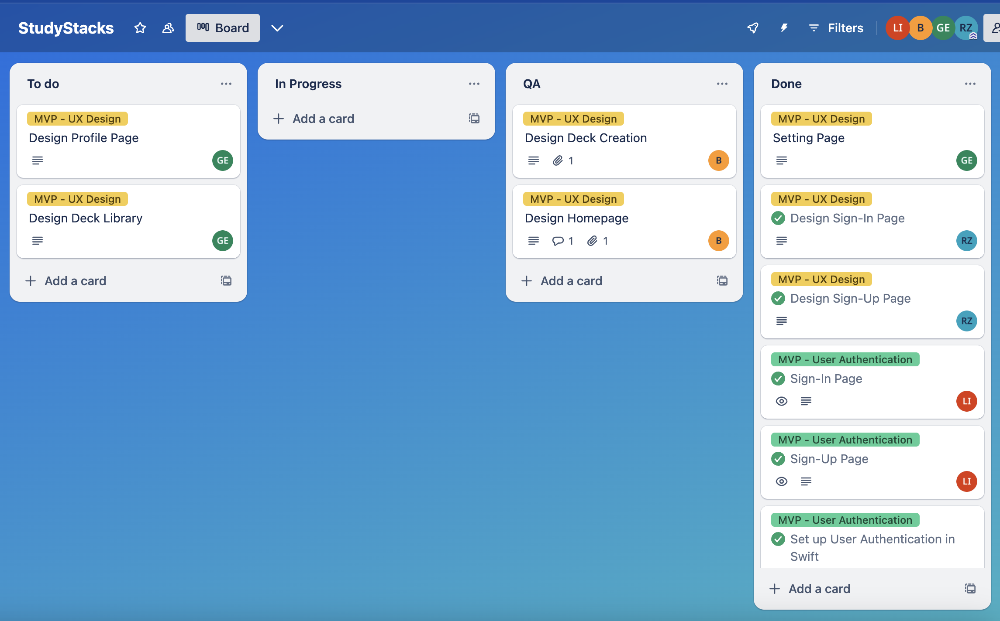

# **Preliminary Project Design**

CMSI 543: Agile Development and Project Management  
19 February 2025

Collaborators: Raihana Zahra, Lauren Campbell, Giselle Eliasi, Brady Katler

## **1.1 Project Overview** 

**Project Name:** StudyStacks

### **Project Description** 

StudyStacks is an iOS application that allows users to create, share, and study flashcards from the convenience of their mobile device. The app will provide an intuitive experience for building flashcard stacks, deliver study reminders based on spaced repetition algorithms, allow the user to discover stacks focused on favored topics, (potentially) share stacks with friends in the app, and encourage continuous learning through a badge and streak system. 

### **Project Management Style**

As a group, we felt that taking a **Scrum** approach to the development of StudyStacks would be the most beneficial due to the focus on shorter iteration cycles, easy adaptability to changing vision, and the continuous feedback with each other. While we’re taking a very collaborative approach, we did define the roles of product owner and scrum master on the team, designating them to Lauren and Brady respectively.

### **Potential Users** 

The primary users are learners or students of various academic levels and age ranges that want to seek an effective studying tool (predominantly high school and upwards).

Secondary users include teachers, tutors, and parents who want to create and share study material to help others, and track learning progress. 

### **Key Features**

* Flashcard Deck Creation → users can create and organize their own study stacks  
* Flashcard Library → users can browse public decks by category or keyword  
* User Profiles → each user has a profile with their saved flashcards and study stats  
* Firebase Authentication → supports Google sign-in and email/password sign in  
* Badge System → users are rewarded with displayable badges for completing goals

## **1.2 Preliminary Project Requirements**

**CSCI Components** 

* User Sign In/Sign Up   
  * The user sign up will allow the user to create a new account to which all their data will be saved  
  * The user sign in will allow the user to access their saved data across devices  
* Dashboard   
  * The dashboard will allow the user to see a general overview of major features across the app in one place  
* Flashcard Library   
  * The flashcard library will allow the user to see flashcards from different decks, categories, and users in one place  
* User Profile   
  * The user profile will allow the user to access personal data about their study habits, flashcards, and other relevant information in one place  
  * The user profile will allow the user to manage their account information, including the ability to sign in, sign out, and delete their data  
* Social Page  
  * The social page will allow the user to connect with their peers and manage their in-app friends  
  * The social page will allow the user to see recent decks created by their in-app friends.

### **User Stories**

* User \+ Profile  
  * Account → As a student, I want to be able to **have an account** that saves all of my flashcards and other data.  
  * Onboarding → As a student with specific study interests, I want to **tailor my experience** in the app to those interests.  
  * Favorite Decks → As a studious learner, I want to save and quickly access my **favorite decks** so that I can efficiently review my most relevant materials.  
  * Streak → As an active learner, I want to **track my daily study streak** so that I can stay motivated and maintain a consistent study habit.  
  * Badges → As an achievement motivated student, I want to earn **badges** so I can feel rewarded as I accomplish studying sessions.  
* Flashcards  
  * Create Decks → As a learner, I want the ability to **create custom decks** so that I can study what’s relevant to my subject of interest and review specific concepts.  
  * Edit Decks → As an occasionally careless learner, I want the ability to **edit my decks** so that I can expand on my decks, fix any mistakes I make, and keep my content up to date.  
  * Edit Flashcards → As a learner who makes mistakes, I want the ability to **edit my flashcards** so that I can edit any typos.  
  * Delete Decks → As a learner with evolving studying needs, I want the **ability to delete** decks so that my profile is not crowded with decks I am not using.  
  * Flip Flashcards → As a careful learner, I want the ability to **flip flashcards** so I can double check that my response matches the definition to test my knowledge.  
  * Delete Flashcards → As an evolving learner, I want to be able to **delete flashcards** so that I can remove any outdated cards.   
* Social  
  * Leaderboard → As a competitive learner, I want to have a public **leaderboard** so I can compare my performance to my friends and stay motivated.  
  * Friends → As a socially connected learner, I want to add and interact with **friends** so that I can study collaboratively and stay engaged.   
  * Shared Decks → As a socially connected learner, I want to be able **to see decks that my peers make** so that we can share resources. 

## **1.3 Preliminary Design Description**

StudyStacks will be an application that primarily relies on the iPhone as the place of interaction for the user’s to initiate certain actions, such as view flashcards and study decks, and have more direct interactions with the system. 

### **System Architecture Design**

As seen in the figure above, the user will interact directly with the iPhone as the main interface. The MVVM structure of the iOS app will handle user interaction between the software and the consumer, while the Firebase Auth will communicate with the app to manage user login via Google sign in and email/password connection. The app will also interact with the Firestore Database to store user data, including but not limited to: the user themself, user created flashcards, IDs of saved flashcards, and known friends. 

### **User Flow Diagram**

The user will follow this general outline to navigate through StudyStacks. Users will be presented with a splash screen upon opening the app while not signed in, and be presented with the option to either sign back in, or sign up for an account. Signing back in will lead the user directly to the dashboard, whereas signing up will take the user through the onboarding process before navigating to the dashboard. Here, they can continue to navigate to the social section to see their friend’s progress, the flashcard library to view all public and created decks, or to their profile to see their saved decks, current progress in studying, and access their settings. 

## **1.4 Preliminary Development Schedule**

For this project, we decided on scheduling 4 two-week sprints (with some wiggle-room at the end for a 5th sprint if needed), with once a week stand-ups. With this in mind, our SWAG of a timeline is illustrated below: 

* **Sprint 1**: Set up project repository, implement Firebase authentication, design UI layouts  
* **Sprint 2**: Implement basic flashcard mechanisms, user profiles, and onboarding  
* **Sprint 3**: Implement deck sharing, social features, and badges  
* **Sprint 4**: Implement spaced repetition system, test for edge cases and errors  
* (if needed) **Sprint 5**: Clean up, final testing, bug fixes, and submission

An example of our Sprint 1 development progress can be seen below:

## **1.5 Development Tools**

To efficiently develop, test, and manage the iOS application, a combination of software, design, and project management tools will be utilized. These tools will support the frontend and backend development process and are outlined below. 

* **Design & Prototyping:** Figma  
* **Programming Language & Framework:** SwiftUI, Swift (in Xcode)  
* **Backend & Database:** Google Firebase (Authentication and Firestore)  
* **Version Control:** GitHub  
* **Project Management Tool:** Trello   
* **Testing Tools:** Xcode Simulator  
* **Editor**: Xcode
