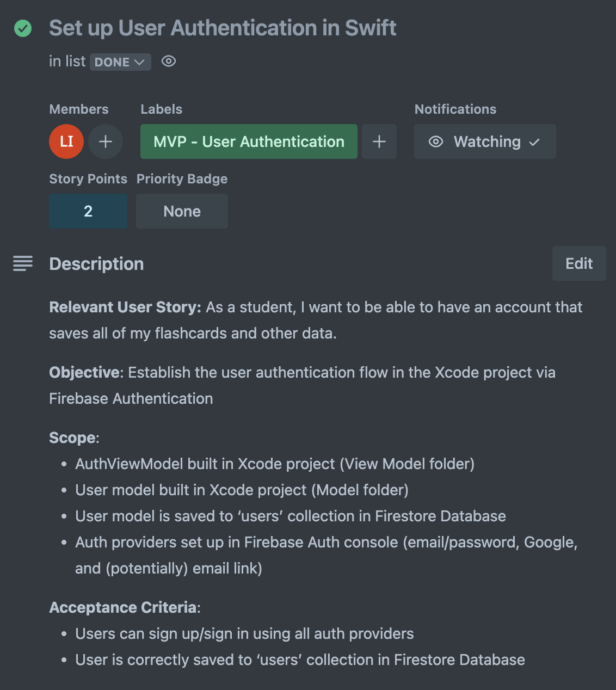

# Sprint Notes

## Sprint 0 (aka pre-planning)
Decided on the following things:
- Project Management System → Trello
- Product Backlog → wrote out everything we wanted to achieve for the product
- Roles (loosely) → Scrum Master (Brady), Product Owner (Lauren)
- Sprint Stand-Ups → Wednesdays at 8:30pm (or earlier, class time allowing)
- Story Points → 1 Point == 30 minutes
- Ticket Format for Trello → example below 
- Created columns for Trello boards → Product Backlog all on one board, and then in the Current Board, all of the To-Dos, In Progress, QA, and Finished tickets

## Sprint 1 
### Planning [2/5]
- **Sprint Goal**: Design all MVP pages in Figma + set up Auth in Xcode
- Sprint Duration → Feb 5 to Feb 19
- Sprint Backlog → All Figma Designs, set up Xcode project, Authentication
- Plan for completion → Figma (divided), Auth (Lauren) [specifics found in Trello]

### Stand-up [2/12]
- No significant blockers
- Brady → doing background research
- Giselle → still working
- Lauren → finished with Auth
- Raihana → finished with Figma

### Review + Retrospective [2/19]
**Review**
- All Figma designs finalized (with the exception of Dashboard, new ticket made for that)
- Ruleset made for GitHub → anything that is to be merged to main requires a PR to be submitted and reviewed by at least one other person

**Retrospective**
- Going forward, need to include more details on Trello
- Actually use QA column instead of sticking things directly into done → we move things into done after the Sprint retrospective? will test next spring

## Sprint 2
### Planning [2/19]
- **Sprint Goal**: Implement profile page, deck creation, and onboarding in Xcode + some minor Figma changes
- Sprint Duration → Feb 19 to March 5
- Sprint Backlog → Figma fixes, Xcode profile, deck, and onboarding base implementations
- Plan for completion [specifics found in Trello]
    - Brady → profile page implementation, fix Dashboard in Figma
    - Giselle → flashcard deletion + deck deletion + deck overview implementation
    - Lauren → deck creation + onboarding implementation, stack overview in Figma
    - Raihana → flashcard components + deck editing in Xcode

### Stand-up [2/26]
- General: addition to tickets → need a way to view decks to test creation
- Brady → no progress
- Giselle → no progress
- Lauren → finished stack overview in Figma, other minor UI changes
- Raihana → no progress

### Review + Retrospective [3/5]
**Review**
- Giselle → didn't finish deck deletion + flashcard deletion, pushing to next sprint
- Brady → Finished work, was not part of GitHub, needs to update user model/auth now to match existing work in GitHub.
- Raihana → finished card component, editing halfway finished, pushing to next sprint to finish
- Lauren → finished deck creation, mostly done with onboarding but need to fix some glitches with Google auth, moved notes to the GitHub docs

**Retrospective**
- TODO: Refine QA process
    - QA process → for normal things, get one other person OR check in at standups
    - GitHub → everyone can review, ideally Lauren and Raihana since experience but still everyone should look at it for bugs or other obvious errors

## Sprint 3
### Planning [3/5]
- **Sprint Goal**: Finalize MVP feature implementation and begin extra features
- Sprint Duration → March 5 - March 19
- Sprint Backlog → now all on Trello
- Plan for completion → now all on Trello

### Stand-Up [3/12]
- Raihana: Working on swipe for next card, bug on swipeout, sounds good
- Lauren: Reviewed all PRs, nothing too bad, needs onboarding to be reviewed by someone, library done
- Giselle: will fix PR notes? Comments? I dunno. Still need to do favorite decks. Storing it in Firebase? Settled on do your best
- Brady: Need to do PR, sample decks are easy, discussed library filtering

### Review + Retrospective [3/19]
**Review**
- Raihana: Editing done, swiping works
- Lauren: Streaks are (technically) implemented, full implementation blocked by card viewing, library done, onboarding done
- Giselle: 90% done with delete, toggle for favorites, couple polishing things tonight
- Brady: Sample decks, Library filtering merged

**Retrospective**
- Turnaround on PRs is too long, we need to review quicker (also, move them to done when you finish them too)
- No more excessively committing (genuinely upset multiple team members, looking at possible punishments (jokes, but not really))

## Sprint 4
### Planning [3/19]
- **Sprint Goal**: Clean up remaining for end-to-end usability   
- Sprint Duration → March 19 - April 2
- Sprint Backlog:
    * Badges  
    * Brainstorming what they’ll be \+ design  
        * Implementation next sprint  
    * Dashboard  
    * Leaderboard  
        * Implement UI/structure for leaderboard  
        * Functionality will be next sprint (measured by points)  
    * Add friends  
    * Remainder of user profiles  
    * “Remembered” flash cards section

### Stand-Up [3/26]
- Lauren: Did all of the PRs (that’s rough), friend page designs, merged stuff to main from PRs
- Raihana: Working on remembered flashcards section
- Giselle: Connected deck overview, deletion done, favorite section done tomorrow, still need stack points, design leaderboard (blocks nothing this sprint)
- Brady: badge ideas done (add streaks), designing badges (make more complicated), finish my PR

### Review + Retrospective [4/2]
**Review**
- Lauren: Friends stuff is done (yay), bad things happen if friend doesn’t exist (needs error handling)
- Raihana: Dashboard WIP, forgot list works, animation WIP, optimistic
- Giselle: favoriting done (also blocking Brady kinda), stack points WIP, work on settings (not pushed), figma leaderboard WIP
- Brady: Badges set, Xcode not working

**Retrospective**
- (Should not wait until Sprint Review to mention that your Xcode isn’t working)
(I fixed this 20 minutes after and will have the PR soon we’re good)
- We need more than 2 QA people (not much we can do tbh, just an observation for future projects)

## Sprint 5
### Planning [4/2]
- **Sprint Goal**: Clean up remaining for end-to-end usability   
- Sprint Duration → April 2 - April 16
- Sprint Backlog:
    *  Implement Badges  
  * Implement Leaderboard(?)  
  * Finish settings  
  * Notifications (Study Reminders)

### Stand-Up [4/9]
- Lauren: Finished reminders, fixed favorites/stack points
- Raihana: Designed dashboard, implemented on Xcode, couple edits on PR
- Giselle: Absent (sick ;/)
- Brady: Was blocked but being resolved in PRs, will be done 

### Review + Retrospective [4/16]
**Review**
- Lauren: Leaderboard, fixed favorite stacks + points, notifications,
- Raihana: Did Dashboard (It looks pretty good), need to implement with leaderboard, 
- Giselle: Just fixed comments on PR, blocked by profile slightly, 
- Brady: Badges are all set, waiting on profile pr. Then badges pr goes out (might actually have code in main after 5 sprints)

**Retrospective**
- Work on resolving PRs correctly (not marking as done when they aren’t done, and moving to done when they're approved)

## Sprint 6
### Planning [4/19]
- **Sprint Goal**: Approve all remaining PRs, E2E testing, and clean up bugs 
- Sprint Duration →  April 16 - April 30
- Sprint Backlog:
    - All unfinished work from previous sprint
    - Lots of small 1 point bug fixes

### Stand-Up [4/23]
- Lauren: edit profile is almost done, works in firebase, did mostly PR reviews
- Raihana: Finished forgotten cards, added leaderboard onto dashboard, changed some colors on dashboard
- Giselle: merged auth and password stuff into main, settings into main, fixed comments on pr, arrows fixed, 
- Brady: profile pr done, badges pr in progress, small tickets on Trello

### Review + Retrospective [4/30]
**Review**
tba

**Retrospective**
tba
